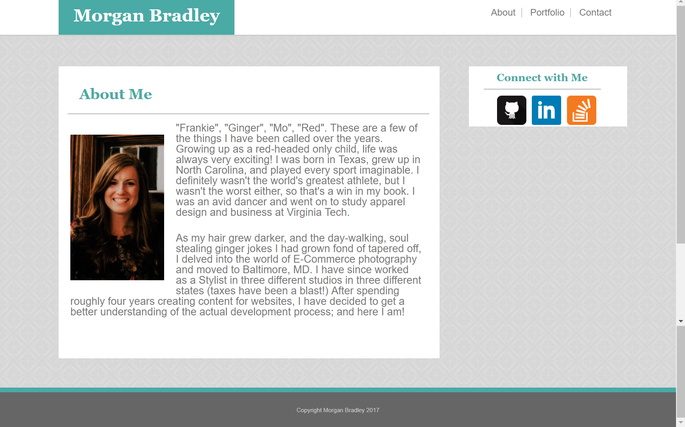
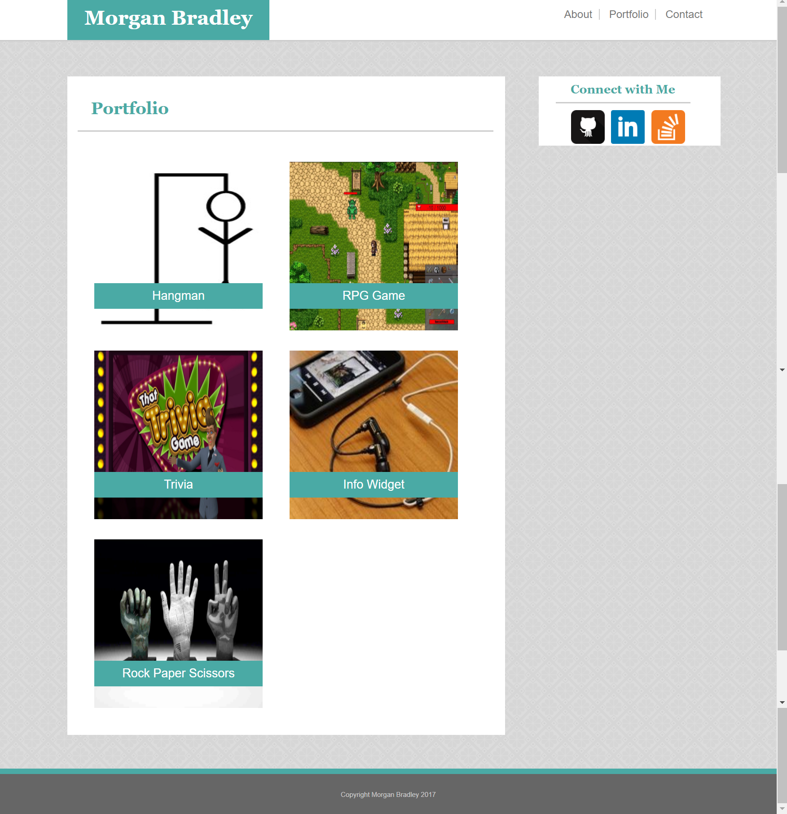
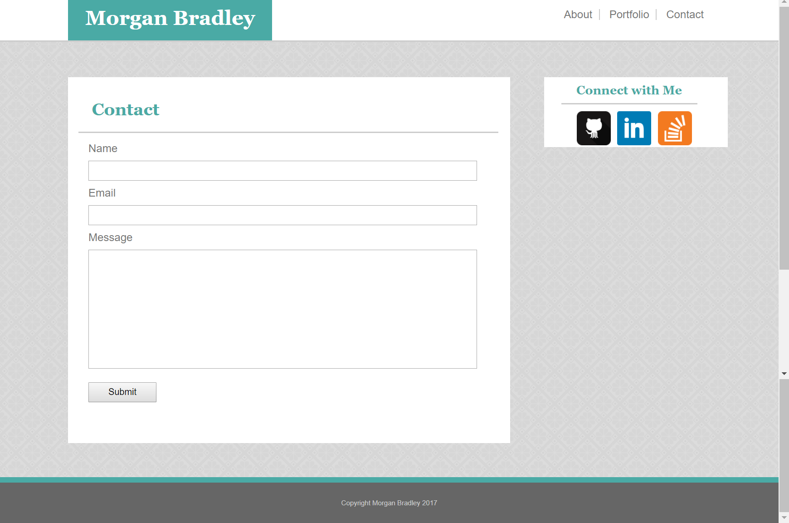
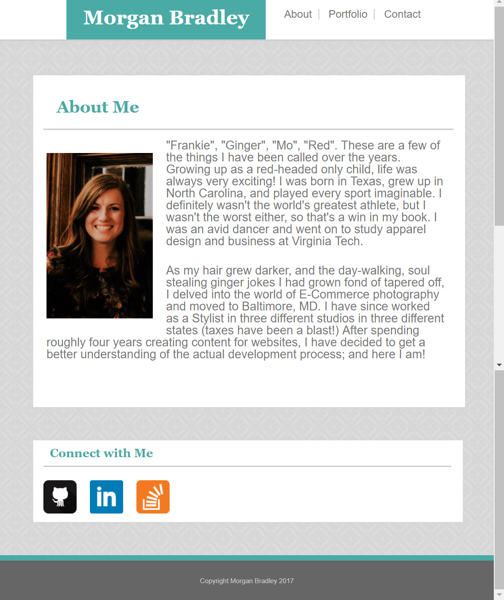
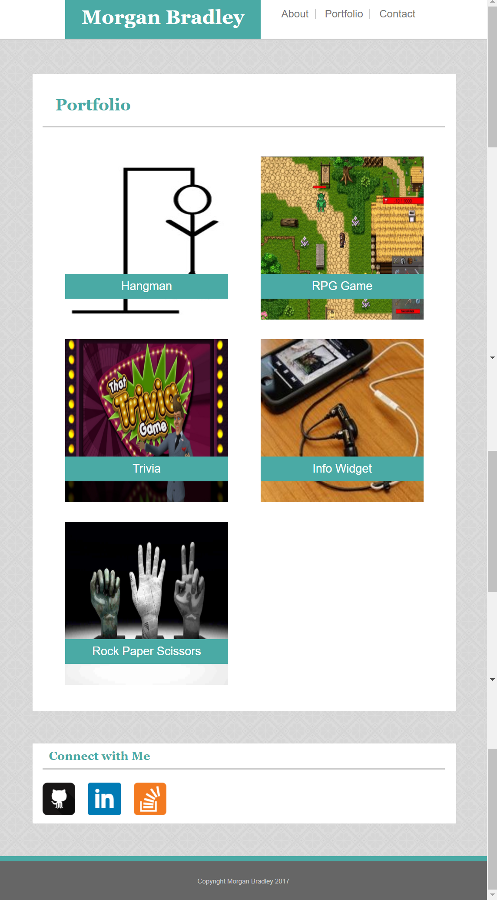
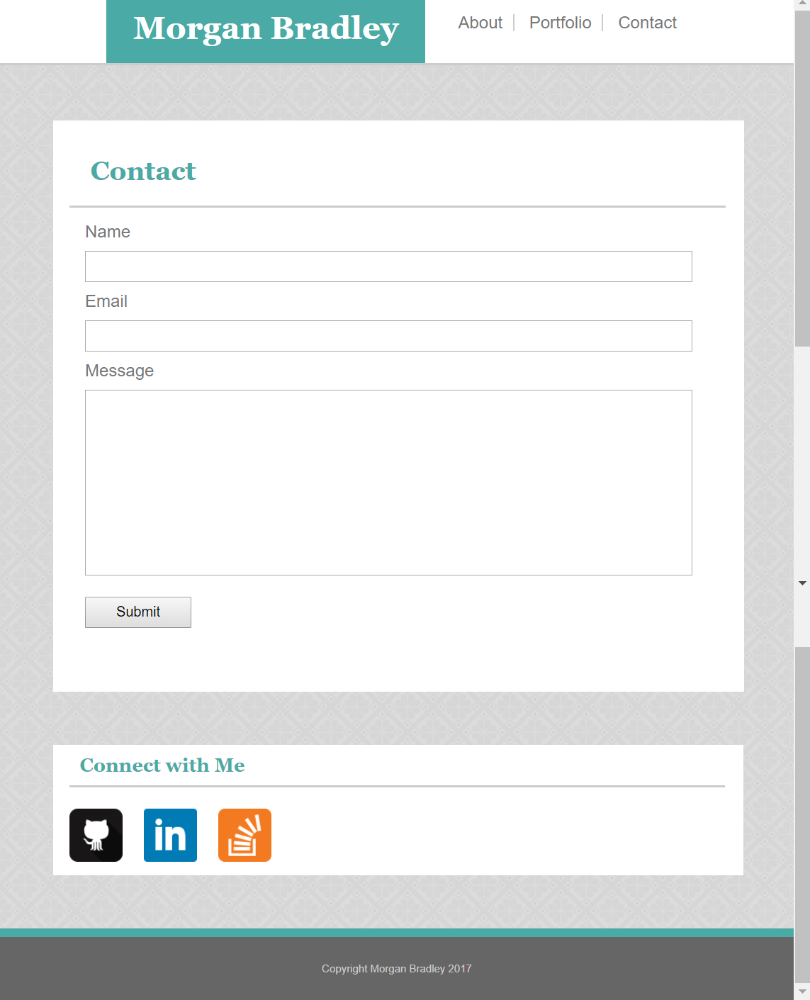
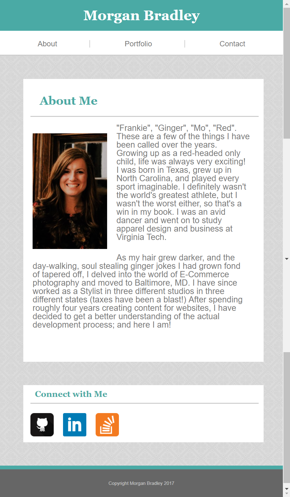
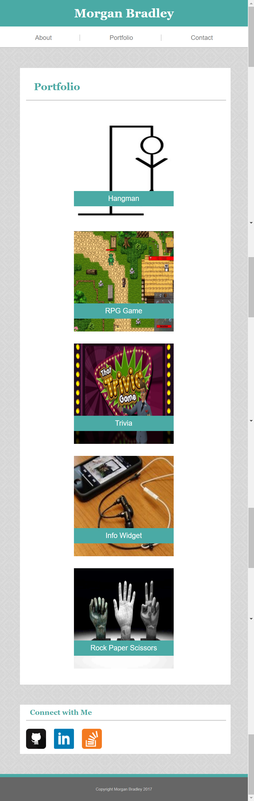
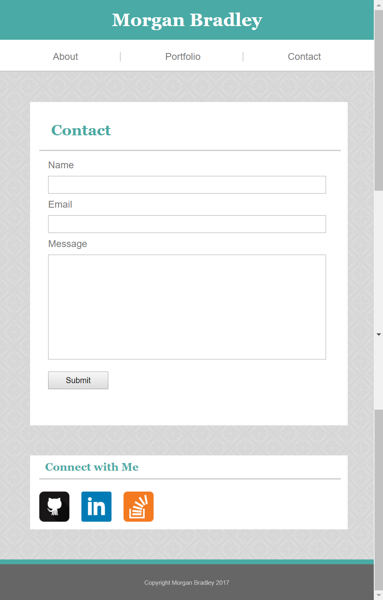

# Responsive-Portfolio

This basic portfolio template expands upon the Basic-Portfolio (built using only **HTML** and **CSS**) by adding **media queries** to create a responsive web design. The media queries included in the style.css file include breakpoints at 640px, 768px and 980px. Please check out the images below for examples.

[Responsive-Portfolio in Browser](https://mfbradley.github.io/Responsive-Portfolio/)  

#### About Me, Portfolio, and Contact Pages at max-width 980px
  

#### About Me, Portfolio, and Contact Pages at max-width 768px
  

#### About Me, Portfolio, and Contact Pages at max-width 640px
  

The Bootstrap-Portfolio takes this template yet another step further using Bootstrap3 and animations. [Click to View](https://github.com/mfbradley/Bootstrap-Portfolio)
